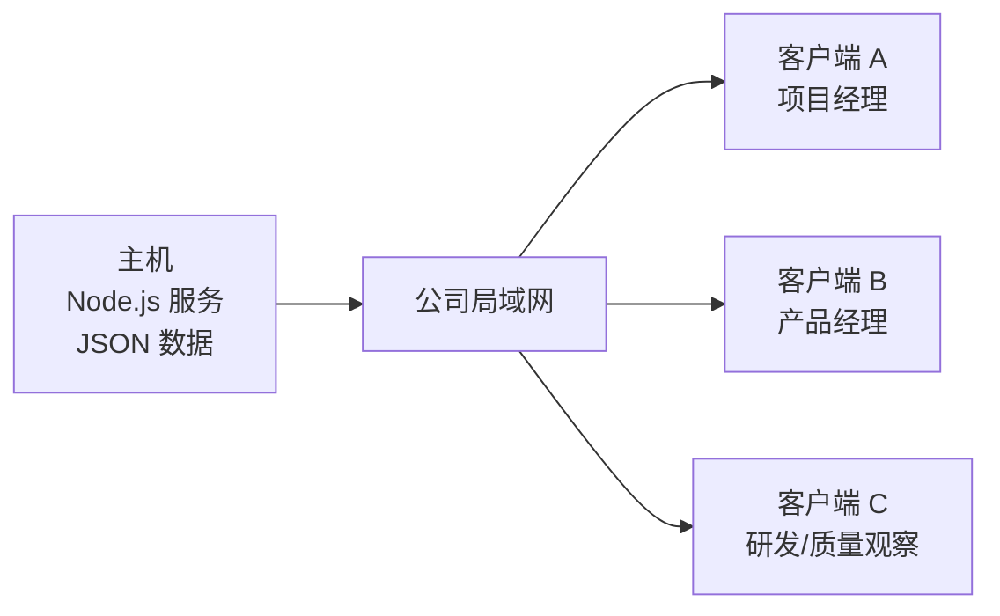

# 局域网安装与产品开发模拟测试指南

适用版本：`codex/agent-driven-lifecycle`

适用日期：2026-07-31

试点方式：一台 macOS/Linux 主机运行服务，其他电脑通过浏览器访问

## 1. 这次测试要验证什么

本指南用于第一次公司内部局域网模拟测试。完成后应能证明：

1. 一台主机可以运行系统，局域网内其他电脑可以访问同一套数据；
2. 新项目创建后只有 S0，不会提前生成 S1-S10；
3. Agent 先生成受控交付物，再由绑定的人员审核；
4. 要求修改后，Agent 任务会自动重新排队；
5. S0 Gate 只有在必需交付物和立项定义满足要求后才能批准；
6. S0 Gate 批准后由 Agent 生成项目蓝图；
7. 项目负责人批准蓝图后，系统才发布 S1-S10 并自动派发 S1 Agent 工作；
8. 待办、通知和审计能够记录关键操作。

本次使用“便携式温湿度记录仪”作为虚构示例。它只存在于测试数据中，不是系统默认产品，也不会改变公司通用流程模板。

## 2. 部署结构



重要规则：

- 只有主机安装和启动本项目。
- 客户端只使用浏览器，不需要安装 Node.js、Git 或项目代码。
- 所有试点数据都保存在主机。
- 客户端不能各自启动一套系统后期待数据自动合并。
- 当前没有正式登录和 SSO。页面右上角的“当前用户”选择器只是内部流程模拟身份，不是安全身份认证。

## 3. 测试人员建议

最低配置是一名测试人员在两个浏览器窗口中切换角色。推荐配置如下：

| 参与者 | 页面模拟身份 | 本次主要工作 |
|---|---|---|
| 项目负责人 | 项目经理 | 创建项目、填写立项定义、审核大部分 S0 文件、批准 S0 Gate、批准蓝图 |
| 产品负责人 | 产品经理 | 审核 PM-001《项目建议书》 |
| 研发或质量观察者 | 系统工程师、硬件工程师或质量工程师 | 观察 Gate 阻塞、S1 专业角色和审计记录 |

S0 默认是立项治理阶段，因此必需交付物的默认审核人只有产品经理和项目经理。研发、质量、制造等专业角色会随着正式蓝图在 S1-S10 中生成。不要为了“多人参与”而使用无权限人员批准 S0 文件，否则系统会按设计返回 403。

## 4. 主机和客户端准备

### 4.1 主机要求

- macOS 或 Linux；
- Node.js 22 或更高版本；
- Git；
- 可访问 GitHub；
- 与客户端处于同一局域网；
- 主机内网地址在测试期间保持稳定；
- TCP 端口 `3001` 未被占用，并允许局域网访问；
- 至少保留 2 GB 可用磁盘空间。

在主机终端检查：

```bash
node --version
npm --version
git --version
```

预期 Node.js 主版本号不低于 22。建议使用公司批准的 LTS 版本；如果版本低于 22，请先通过公司软件源或 Node.js 官方安装包升级，再继续。

### 4.2 客户端要求

- 与主机连接同一个公司有线网络或 Wi-Fi；
- 使用较新的 Chrome、Edge 或 Safari；
- 能访问主机 IP；
- 网络没有启用客户端隔离。

### 4.3 测试前约定

准备以下信息：

| 项目 | 示例 | 实际值 |
|---|---|---|
| 主机负责人 | 张三 |  |
| 主机内网 IP | `192.168.1.20` |  |
| 服务端口 | `3001` |  |
| 试点访问码 | 不要使用本文示例 |  |
| 测试开始时间 | 2026-07-31 09:00 |  |
| 测试参与者 | 项目经理、产品经理、观察者 |  |

访问码应由测试负责人临时设置，不要使用姓名、公司简称或 `123456`。

## 5. 在主机安装

以下命令全部在主机终端执行。

### 5.1 第一次安装

推荐使用 HTTPS 克隆：

```bash
git clone --branch codex/agent-driven-lifecycle https://github.com/yanwei2023/hardware-product-workflow.git
cd hardware-product-workflow
npm install
```

如果主机已经配置 GitHub SSH，也可使用：

```bash
git clone --branch codex/agent-driven-lifecycle git@github.com:yanwei2023/hardware-product-workflow.git
cd hardware-product-workflow
npm install
```

### 5.2 已经安装过时更新

先确认没有需要保留的本地修改：

```bash
git status --short --branch
```

工作区干净时执行：

```bash
git fetch origin
git switch codex/agent-driven-lifecycle
git pull --ff-only origin codex/agent-driven-lifecycle
npm install
```

如果 `git status` 显示未提交修改，停止更新并先保存或评审这些修改。不要使用 `git reset --hard`。

## 6. 运行试点前门禁

在主机项目根目录执行：

```bash
npm run pilot:check
```

该命令会执行：

- 全部 Node 测试；
- React 生产构建；
- API smoke；
- JSON store 完整性检查；
- 持久化、迁移、导出和恢复检查；
- 旧流程兼容演练；
- S0 候选到 S1 自动派工演练；
- 试点归档包生成；
- PostgreSQL 非严格预检。

通过判定：

- 命令最终退出码为 `0`；
- Node 测试显示 `fail 0`；
- React 构建显示 `built`；
- `pilot:rehearse:s0` 输出包含：

```text
"ok": true
"phaseCount": 11
"formalPhaseCount": 10
"currentPhaseKey": "s1_market_definition"
"s1QueuedAgentJobCount": 大于 0
```

当前主机如果没有配置 `DATABASE_URL` 或没有安装 `psql`，最后的 PostgreSQL 非严格预检会列出 blockers。这表示可选的 PostgreSQL 环境没有准备好，不代表默认 JSON 局域网试点失败。应以整个 `npm run pilot:check` 的最终退出码为准。

如果命令非零退出，不要启动试点。保存失败输出并先处理错误。

## 7. 启动局域网服务

### 7.1 设置访问码并启动

在主机项目根目录执行，把示例值替换成实际访问码：

```bash
HARDWARE_FLOW_PILOT_ACCESS_CODE=change-this-code npm run start:lan
```

预期终端显示：

```text
Hardware Flow API listening on http://localhost:3001
LAN mode enabled. Use this machine's LAN IP from other devices.
```

该终端窗口必须保持运行。关闭窗口或按 `Ctrl+C` 会停止服务。

如果 `3001` 端口被占用，可改用：

```bash
HOST=0.0.0.0 PORT=3191 HARDWARE_FLOW_PILOT_ACCESS_CODE=change-this-code npm start
```

后续地址中的 `3001` 也要改为 `3191`。

### 7.2 主机健康检查

在主机浏览器依次打开：

```text
http://localhost:3001/health
http://localhost:3001/ready
http://localhost:3001/runtime/network
```

预期结果：

- `/health`：HTTP 200，包含 `"ok": true`；
- `/ready`：HTTP 200，包含 `"ready": true`；
- `/runtime/network`：包含 `"lanMode": true`，并显示 `preferredUrl`。

记录 `/runtime/network` 中的 `preferredUrl`，例如：

```text
http://192.168.1.20:3001
```

### 7.3 客户端连接

在客户端浏览器打开主机的 `preferredUrl`。

首次读取项目数据时，页面会要求输入试点访问码。输入主机启动时设置的同一访问码。

预期结果：

- 页面显示 `Hardware Flow · Human + Agent`；
- 页面顶部显示当前项目、阶段和阶段门；
- 页面右上角有当前用户选择器；
- 刷新页面后仍可读取数据。

至少使用一台非主机电脑完成此检查，才能证明局域网访问真实可用。

### 7.4 访问码反向检查

在客户端新开一个无痕/隐私窗口：

1. 打开主机的 `preferredUrl`；
2. 不输入访问码或故意输入错误访问码；
3. 尝试加载项目数据；
4. 再输入正确访问码。

预期错误或缺失访问码时，数据请求被拒绝并提示需要试点访问码；输入正确访问码后才显示项目数据。静态页面、`/health`、`/ready` 和 `/runtime/network` 保持可访问属于正常设计。

## 8. 测试开始前创建检查点

在工作台中：

1. 打开“项目”；
2. 找到“本地数据状态”；
3. 点击“创建检查点”；
4. 输入标签：

```text
before-temperature-pilot
```

预期“最近检查点”中出现新记录。

也可在主机终端检查数据文件：

```bash
npm run store:doctor
```

预期结果包含：

```text
"valid": true
```

## 9. 模拟项目的立项数据

本次模拟使用以下输入。

| 字段 | 填写内容 |
|---|---|
| 项目名称 | 便携式温湿度记录仪试点 |
| 产品构想 | 为实验室、仓储和小型工业现场提供可连续记录、现场查看和导出数据的便携式温湿度记录产品 |
| 项目类型 | 全新产品开发 |
| 目标市场 | 实验室，仓储，小型工业现场 |
| 客户场景 | 环境巡检，连续记录，现场查看，数据导出 |
| 产品能力范围 | 电子硬件；嵌入式固件；结构与工业设计；测量与信号链；实体产品验证 |
| 技术范围 | 传感器，采集电路，低功耗固件，显示与存储，便携外壳 |
| 合规要求 | 电气安全适用性，EMC 适用性，环保要求，计量适用性 |
| 供应模式 | 核心设计自研，PCB 和结构件外协 |
| 交付模式 | 标准产品销售，提供说明书和基础售后 |
| 运营要求 | 校准建议，固件维护，客户问题处理 |
| 风险等级 | `MEDIUM` |

这些内容用于验证流程，不代表已经完成真实市场调研、法规判定或技术可行性评估。Agent 当前生成的是确定性模板模拟结果，不能作为正式产品决策证据。

## 10. 从 S0 到 S1 的完整模拟

### 步骤 1：创建 S0 立项候选

操作：

1. 右上角当前用户选择“项目经理”；
2. 打开“项目”；
3. 在“创建 S0 立项候选”填写项目名称和产品构想；
4. 点击“创建 S0 立项候选”。

预期结果：

- 提示“S0 立项候选已创建，Agent 工作已派发”；
- 当前阶段为“S0 立项与治理”；
- 项目状态为 `S0_DRAFT`；
- 只存在 S0，不存在正式 S1-S10；
- 显示已排队 10 个 Agent 任务。

异常处理：

- 按钮不可点：确认项目名称和产品构想都不为空；
- 提示 401：重新输入试点访问码；
- 创建后出现 S1-S10：停止测试并按严重问题记录。

### 步骤 2：填写并保存立项定义

操作：

1. 在“S0 立项定义与正式流程配置”填写第 9 节全部字段；
2. 勾选五个产品能力；
3. 风险等级选择 `MEDIUM`；
4. 点击“保存立项定义”；
5. 点击“预览项目配置蓝图”。

预期结果：

- 页面不再显示“尚缺”字段；
- 定义版本号增加；
- 蓝图预览显示 10 个正式阶段；
- 当前标准库下，该示例预览显示 53 份适用文档，其中 50 份必需、3 份普通受控，并配置 53 个 Agent 任务；
- 预览只读，不会发布 S1-S10；
- 页面仍明确显示“S0 候选边界生效”。

异常处理：

- 提示字段缺失：按页面“尚缺”列表补充；
- 预览按钮不可点：先保存已修改的立项定义；
- 能预览但已出现正式 S1-S10：停止测试并记录。

### 步骤 3：处理 10 个 S0 Agent 任务

操作：

1. 打开“工作包”；
2. 选择任一当前阶段工作包；
3. 点击“处理下一条”；
4. 重复点击并等待页面刷新，直到项目页显示排队任务为 0；
5. 逐个打开工作包，查看“模板校验”“Agent 队列”和“交付物”。

“处理下一条”处理的是整个项目队列中最早的一条任务，不只处理当前选中的工作包。

预期结果：

- 10 个任务依次从 `QUEUED` 变为 `COMPLETED`；
- 每个工作包生成待审核交付物；
- 模板校验为 `PASSED`；
- S0 Gate 仍处于阻塞状态，因为还没有完成人工审核。

异常处理：

- 任务变为 `FAILED`：记录工作包、Agent、结果码、页面请求 ID；
- 没有交付物：刷新后重查；仍缺失则记录问题；
- 未审核就可通过 Gate：按严重问题记录。

### 步骤 4：验证“要求修改→Agent 重新排队”

选择以下工作包：

```text
PM-003 项目总体开发计划
```

操作：

1. 右上角当前用户选择“项目经理”；
2. 点击“要求修改”；
3. 查看该工作包“Agent 队列”；
4. 点击“处理下一条”；
5. 确认生成新的待审核版本；
6. 点击“批准”。

预期结果：

- 审核记录出现 `REQUEST_REVISION`；
- 自动新增一条 `QUEUED` Agent 任务；
- 处理后新任务为 `COMPLETED`；
- 新交付物可以由项目经理批准；
- 旧的待审核版本不会继续作为当前待审交付物。

异常处理：

- 没有自动重新排队：刷新一次后检查；仍没有则记录问题；
- 无权限批准：确认当前用户是该工作包绑定的项目经理；
- 仍在审核旧版本：停止对该工作包操作并记录。

### 步骤 5：批准 S0 Gate 必需交付物

S0 共 10 个工作包，其中以下 8 个是 Gate 必需项：

| 工作包 | 默认审核人 |
|---|---|
| PM-001 项目建议书 | 产品经理 |
| PM-002 项目章程 | 项目经理 |
| PM-003 项目总体开发计划 | 项目经理 |
| PM-004 项目组织与 RACI 责任矩阵 | 项目经理 |
| PM-006 项目风险登记册 | 项目经理 |
| CM-001 文档与配置管理计划 | 项目经理 |
| CM-002 项目文档体系与文档清单 | 项目经理 |
| CM-004 阶段门评审总表 | 项目经理 |

操作：

1. 右上角切换为“产品经理”，打开 PM-001 并点击“批准”；
2. 切换为“项目经理”；
3. 逐个打开其余 7 个必需工作包并点击“批准”；
4. PM-003 如果已在步骤 4 批准，不要重复批准；
5. PM-005 和 CM-003 为非 Gate 必需项，可批准，也可保留供观察。

预期结果：

- 8 个必需工作包均为人类批准状态；
- 错误身份无法批准不属于自己的工作包；
- Gate 不会因为两个非必需项未审核而被错误阻塞。

异常处理：

- 403：查看“项目→当前项目角色配对”，确认工作包负责人，并切换右上角用户；
- “没有可审核的待审交付物”：确认该工作包 Agent 任务已经完成；
- 重复批准失败属于正常保护，不要继续重复点击。

### 步骤 6：检查并批准 S0 Gate

操作：

1. 切换当前用户为“项目经理”；
2. 打开“阶段门”；
3. 点击“重新检查”；
4. 查看审核包证据和阻塞项；
5. 当状态为 `READY` 时点击“批准阶段门”；
6. 输入批准说明：

```text
模拟试点已确认 S0 立项定义、必需交付物和审核记录，批准进入项目蓝图配置。
```

预期结果：

- 审核前状态从 `BLOCKED` 变为 `READY`；
- 项目经理可以批准 S0 Gate；
- 立项定义基线被冻结，字段不能继续修改；
- 项目状态进入蓝图配置；
- 系统创建“项目正式配置蓝图”工作包并排队一个 Agent 任务；
- 此时仍不能提前出现正式 S1-S10。

异常处理：

- Gate 仍为 `BLOCKED`：查看阻塞项，定位未批准必需工作包或未完成字段；
- “批准阶段门”不可点：状态还不是 `READY`；
- 非项目经理能批准：停止测试并记录权限问题；
- S0 Gate 批准后直接发布 S1-S10：停止测试并记录。

### 步骤 7：处理并批准项目蓝图

操作：

1. 打开“工作包”；
2. 选择“项目正式配置蓝图”；
3. 点击“处理下一条”；
4. 查看生成的蓝图交付物和模板校验；
5. 当前用户保持“项目经理”；
6. 点击“批准”。

预期结果：

- 蓝图 Agent 任务为 `COMPLETED`；
- 蓝图交付物包含 10 个正式阶段和项目适用文档配置；
- 蓝图批准前没有正式 S1-S10；
- 蓝图批准后项目状态进入正式执行。

异常处理：

- 蓝图任务不存在：确认 S0 Gate 已批准；
- 模板校验不通过：记录缺失章节，不要批准；
- 非项目经理批准成功：记录权限问题；
- 重复批准产生重复阶段：按严重问题记录。

### 步骤 8：确认正式流程和 S1 自动派工

操作：

1. 回到“项目”；
2. 查看项目列表和当前阶段；
3. 打开“工作包”查看 S1 工作包；
4. 查看 Agent 队列；
5. 导出项目 JSON 快照，检查阶段数组。

预期结果：

- 总阶段数为 11：S0 加 S1-S10；
- 正式阶段数为 10；
- 当前阶段是“S1 市场与产品定义”；
- S1 工作包已经生成；
- S1 Agent 任务已经自动进入 `QUEUED`；
- 不需要人员手工创建 S1 流程或逐项加入初始队列。

异常处理：

- 阶段少于或多于 11：保存导出快照并记录；
- 当前阶段不是 S1：记录项目状态和审计事件；
- S1 没有排队 Agent 任务：刷新后重查，仍缺失则记录。

### 步骤 9：检查待办、通知和审计

操作：

1. 分别打开“待办”“通知”“审计”；
2. 在右上角切换项目经理、产品经理等用户；
3. 查找本次项目的关键事件。

至少应能找到：

```text
PROJECT_CANDIDATE_CREATED
INITIATION_DEFINITION_UPDATED
AGENT_JOB_PROCESSED
HUMAN_REVIEW_SUBMITTED
GATE_APPROVED
PROJECT_BLUEPRINT_PUBLISHED
```

预期结果：

- 不同用户看到与其责任相关的待办和通知；
- 通知可标记已读；
- 审计能回答谁在什么时候对哪个对象执行了什么操作；
- 蓝图发布和 S1 派工有可追踪记录。

异常处理：

- 操作成功但没有审计：记录对象、时间和请求 ID；
- 通知指向错误项目或工作包：记录截图；
- 用户切换后数据没有刷新：点击页面右上角“刷新”。

## 11. 测试结果记录

复制下表到测试记录中：

| 编号 | 验证项 | 预期结果 | 实际结果 | 结论 | 证据或问题编号 |
|---|---|---|---|---|---|
| 1 | `pilot:check` | 退出码 0 |  | 通过/失败 |  |
| 2 | 主机健康 | `/health` 200、`ok: true` |  | 通过/失败 |  |
| 3 | 主机就绪 | `/ready` 200、`ready: true` |  | 通过/失败 |  |
| 4 | 客户端访问 | 至少一台其他电脑可访问 |  | 通过/失败 |  |
| 5 | 访问码 | 错误或缺失访问码不能读取数据 |  | 通过/失败 |  |
| 6 | S0 边界 | 创建后只有 S0 和 10 个任务 |  | 通过/失败 |  |
| 7 | 蓝图预览 | 10 个正式阶段、53 份文档，且未发布 |  | 通过/失败 |  |
| 8 | Agent 处理 | 10 个 S0 任务完成 |  | 通过/失败 |  |
| 9 | 退回重做 | 自动重新排队并生成新版本 |  | 通过/失败 |  |
| 10 | 人工审核 | 8 个必需项由正确人员批准 |  | 通过/失败 |  |
| 11 | S0 Gate | BLOCKED→READY→APPROVED |  | 通过/失败 |  |
| 12 | 基线冻结 | Gate 批准后立项定义不可修改 |  | 通过/失败 |  |
| 13 | 蓝图审核 | 项目经理批准后才发布 |  | 通过/失败 |  |
| 14 | 正式流程 | 共 11 个阶段，当前 S1 |  | 通过/失败 |  |
| 15 | S1 派工 | S1 Agent 任务自动排队 |  | 通过/失败 |  |
| 16 | 待办/通知/审计 | 关键操作可追踪 |  | 通过/失败 |  |
| 17 | 数据检查点 | 测试前检查点存在 |  | 通过/失败 |  |

通过标准：编号 1–17 全部通过。任何阶段错误发布、数据损坏、权限错误放行或无法回滚的问题均应停止试点。

## 12. 问题记录要求

每个问题至少记录：

- 发生时间；
- 操作人员和页面右上角选择的模拟身份；
- 页面和对象名称；
- 请求 ID；
- 服务版本；
- 复现步骤；
- 预期结果；
- 实际结果；
- 是否影响阶段门、数据完整性或回滚；
- 截图；
- 导出的项目 JSON 快照。

问题分级：

- S1：数据损坏、阶段错误放行、权限错误放行、无法启动或无法回滚；
- S2：候选创建、Agent、审核、Gate、蓝图或 S1 派工主流程阻塞；
- S3：文案、页面显示、非关键导出或一般易用性问题。

出现 S1 时立即停止所有参与者操作并保留主机现场。

## 13. 停止、备份和恢复

### 13.1 正常停止

回到运行服务的主机终端，按：

```text
Ctrl+C
```

等待终端显示关停完成。不要直接关闭主机电源。

### 13.2 检查数据

停止服务后运行：

```bash
npm run store:doctor
```

预期 `"valid": true`。

默认数据文件：

```text
data/demo-store.json
```

每次写入前，系统会维护同目录 `.bak`。正式试点还应备份整个 `data` 目录到受控位置。

### 13.3 从检查点恢复

服务运行且数据仍可访问时，可在：

```text
项目 → 本地数据状态 → 最近检查点
```

选择试点前检查点恢复。恢复前系统会保留当前数据副本。

### 13.4 从 `.bak` 恢复

如果主文件异常，先停止服务并运行：

```bash
npm run store:doctor
npm run store:restore-backup
```

恢复后重新运行：

```bash
npm run store:doctor
npm run pilot:rehearse:s0
```

不要手工删除 `data/demo-store.json` 或覆盖 `.bak`。

## 14. 常见故障

### Node.js 或 npm 不存在

现象：

```text
command not found: node
command not found: npm
```

处理：安装 Node.js 22 LTS，关闭并重新打开终端，再运行版本检查。

### 端口被占用

现象：

```text
EADDRINUSE
```

处理：

```bash
HOST=0.0.0.0 PORT=3191 HARDWARE_FLOW_PILOT_ACCESS_CODE=change-this-code npm start
```

### 主机能访问，客户端不能访问

依次检查：

1. `/runtime/network` 是否显示 `"lanMode": true`；
2. 客户端与主机是否在同一网段；
3. 是否误用了 `localhost`；
4. 系统防火墙是否允许 Node.js 或端口 `3001`；
5. Wi-Fi 是否启用了客户端隔离；
6. 公司网络是否禁止设备间直接访问。

只在获得公司网络管理员授权后调整防火墙规则。

### 页面反复要求访问码

检查：

- 客户端输入值是否与主机环境变量完全一致；
- 是否包含多余空格；
- 主机是否重启并更换了访问码；
- 浏览器是否禁止本地存储。

可点击页面顶部“清除访问码”后重新输入。

### PostgreSQL 预检提示 blockers

如果 `npm run pilot:check` 最终退出码为 0，而 blockers 只有：

```text
DATABASE_URL is not configured
psql is not available
```

则可继续 JSON 局域网试点。这不代表 PostgreSQL 已经可用，也不能把当前部署描述为 PostgreSQL 生产部署。

### 审核返回 403

当前用户不是该工作包绑定负责人。到：

```text
项目 → 当前项目角色配对
```

确认负责人，再在右上角切换为对应用户。S0 的 PM-001 默认由产品经理审核，其余必需项默认由项目经理审核。

### Gate 一直 BLOCKED

打开“阶段门”，点击“重新检查”，逐条查看阻塞项。常见原因：

- 立项定义仍有缺失字段；
- Agent 任务未完成；
- 必需工作包没有待审交付物；
- 必需工作包未由正确人员批准；
- 存在未处理的阻塞风险。

不要通过修改数据文件绕过 Gate。

## 15. 当前版本边界

当前结论是“局域网模拟试点就绪”，不是“生产就绪”。

尚未完成的生产能力包括：

- 外部大模型调用、模型账号和成本治理；
- 正式用户登录、SSO 和细粒度身份认证；
- 完整 PostgreSQL 在线 repository；默认试点仍使用 JSON store；
- 单份项目文档等级手动调整、条件适用 N/A 和降级例外审批的完整操作闭环；
- 生产级 TLS、反向代理、数据库备份和灾备；
- 多人高并发编辑冲突处理；
- 飞书、企业微信和邮件通知。

当前 Agent 队列、模板校验、确定性输出、人类审核、阶段门、蓝图编译和自动派工是真实可运行的流程模拟层；它不等同于外部大模型已经完成真实市场研究、工程设计或合规判断。
